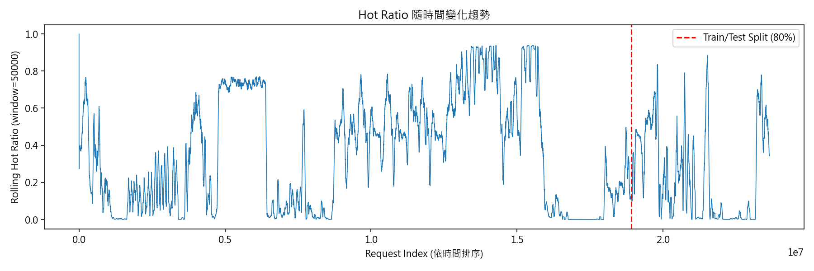
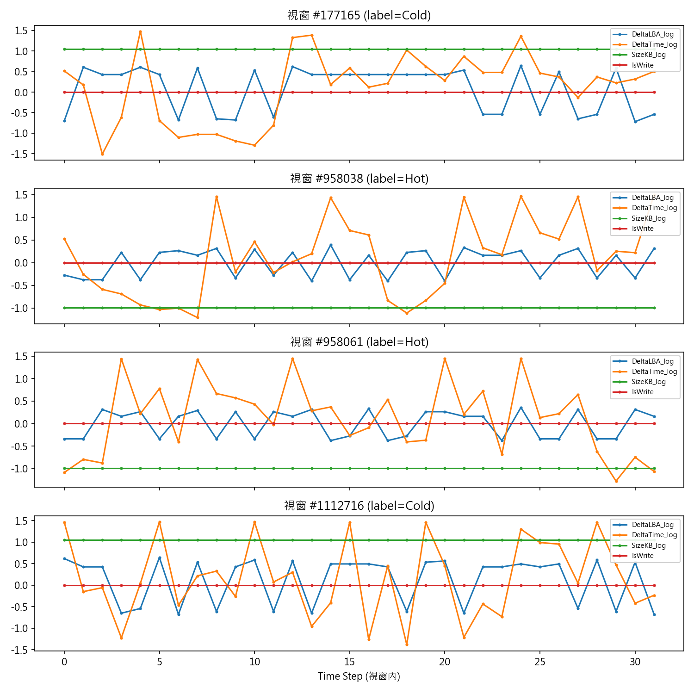
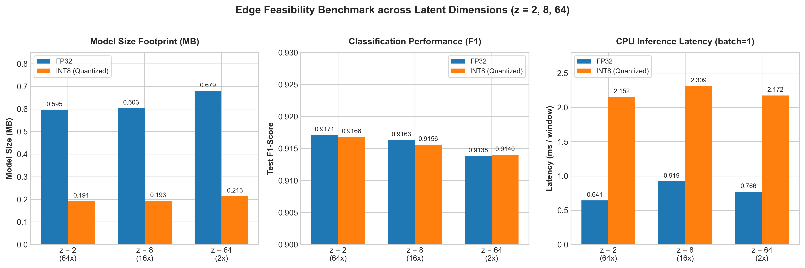

# SSD Trace Access Pattern Compression and Hot/Cold Classification via Dual-Head Autoencoder

> **Executive Summary (TL;DR)**
> * **Objective**: Applied a 1D Conv + Squeeze-and-Excitation (SE) Attention Autoencoder to compress SSD I/O Traces while preserving downstream Hot/Cold data classification usability in edge computing environments.
> * **Key Results**: Reduced 128-dimensional trace features to a **2D latent space (64x compression)** while achieving a **Test F1-Score of 0.9171**, outperforming the uncompressed 128-dim XGBoost Baseline (F1 = 0.9115).
> * **Edge Feasibility**: Achieved **INT8 static quantization size of 0.191 MB** (3.11x reduction, 0.641 ms CPU latency) with negligible accuracy degradation (ΔF1 = -0.0003), proving 100% SRAM-friendly feasibility for storage controllers (< 0.2 MB).
> * **Methodology**: Evaluated on MSR Cambridge Traces with zero-leakage chronological split and buffer window isolation.

---

# 基於雙分支自編碼器之 SSD 存取軌跡壓縮與冷熱分類系統
### Dual-Branch Autoencoder for SSD Access Trace Compression and Hot/Cold Classification

**摘要**

本研究延伸先前於通道狀態資訊（CSI）壓縮任務中所發展之 Conv + Squeeze-and-Excitation（SE）Attention 自編碼器架構，將其應用於固態硬碟（SSD）邊緣運算場景，探討存取軌跡（I/O Trace）資料之潛在表示（latent representation）壓縮，並驗證該表示是否能在大幅降維的同時，維持下游熱冷資料分類任務之可用性。本研究以 MSR Cambridge Traces 公開資料集為實驗對象，建立完整之資料前處理流程、自監督熱冷標籤生成機制，並設計雙任務（重建與分類）神經網路模型。實驗結果顯示，於 128 維原始特徵空間中訓練之 XGBoost 基準模型可達 F1 = 0.9115；而本研究提出之模型於潛在維度壓縮至 2 維（壓縮率 64 倍）時，仍可達到 F1 = 0.9171，優於基準模型表現。進一步之特徵消融實驗與潛在維度掃描顯示，熱冷分類任務之判別訊號高度集中於少數統計特徵，致使分類效能於極低維度即已飽和，而波形重建任務則持續受益於維度提升，兩者呈現明顯不同之壓縮—效能取捨關係。最後，本研究於 CPU 環境下驗證模型之邊緣部署可行性，模型體積小於 0.7 MB，並發現動態量化於此規模之模型上會導致推論延遲不減反增之反直覺現象，本文對此提出解釋並給出部署建議。

**關鍵詞**：固態硬碟、邊緣運算、資料壓縮、自編碼器、熱冷資料分類、Squeeze-and-Excitation Attention、模型量化

---

## 1. 緒論

### 1.1 研究動機

隨著邊緣運算裝置對儲存效率與能耗之要求日益提升，如何在有限運算資源下對儲存系統資料進行有效壓縮，已成為重要之研究課題。既有研究多聚焦於通用資料之無損壓縮（如 LZ4、Zstd），較少探討深度學習方法於儲存系統軌跡資料（I/O Trace）分析任務中之適用性。本研究延伸自作者先前完成之通道狀態資訊（Channel State Information, CSI）壓縮專題，該專題採用 3D 卷積結合 SE Attention 之自編碼器架構，於通訊系統之通道估計任務中取得良好之壓縮率與重建品質。本研究嘗試將該架構之設計精神延伸至 SSD 邊緣運算場景，探討其於異質應用領域之可遷移性。

### 1.2 研究目的與貢獻

本研究之核心目的，在於驗證「以深度學習模型將 SSD 存取軌跡壓縮至低維潛在表示，是否能在大幅降維之同時，維持下游任務（熱冷資料分類）之可用性」。本文之主要貢獻如下：

1. 建立一套嚴謹之 SSD Trace 前處理流程，並系統性地識別與修正多項資料洩漏風險（跨磁碟特徵污染、滑動視窗重疊洩漏、驗證集切分洩漏等）；
2. 透過特徵消融實驗，量化不同特徵對熱冷分類任務之邊際貢獻，據以驗證模型設計之必要性；
3. 系統性掃描潛在維度對分類效能與重建品質之影響，繪製壓縮率—效能取捨曲線；
4. 於 CPU 環境下驗證模型之邊緣部署可行性，包含模型體積、推論延遲、與量化效果之實證分析。

### 1.3 本文架構

本文第 2 節說明研究背景；第 3 節描述研究方法，包含資料集、特徵工程與模型架構；第 4 節說明實驗設計；第 5 節呈現實驗結果與分析；第 6 節進行討論並說明研究限制；第 7 節總結全文。

---

## 2. 背景與相關概念

### 2.1 SSD 儲存系統與 I/O Trace

SSD 控制器於運作過程中會產生大量存取請求記錄（I/O Trace），內容包含時間戳記、邏輯區塊位址（LBA）、請求大小與讀寫類型等欄位。此類資料常用於工作負載特徵分析、快取策略設計與磨損平衡演算法之研究。由於此類記錄具有時間序列與空間局部性特性，理論上適合以序列建模方法進行分析。

### 2.2 資料壓縮於邊緣運算之應用

邊緣裝置通常面臨儲存空間、運算資源與頻寬三方面之限制。對於直接壓縮儲存資料之應用場景，需滿足無損壓縮之硬性要求，且對延遲極為敏感；相較之下，針對存取軌跡進行壓縮之應用場景（如健康監測、離線分析、雲端回傳），其延遲容忍度較高，且可接受一定程度之近似壓縮，因此本研究選擇以存取軌跡壓縮與下游任務分析作為研究對象。

### 2.3 研究基礎：CSI 通道壓縮專題

本研究之模型架構設計，延續先前 CSI 壓縮專題之核心精神：以卷積層搭配 SE Attention 機制之編碼器，將高維輸入壓縮至低維潛在空間，並透過課程學習（curriculum learning）策略分階段訓練重建任務。本研究將此架構自二維（天線 × 子載波）之通道矩陣輸入，改造為一維時間序列（時間步 × 特徵）輸入，並額外引入分類任務作為第二個訓練目標。

---

## 3. 研究方法

### 3.1 資料集

本研究採用 MSR Cambridge Traces（SNIA IOTTA Repository）作為實驗資料，具體使用 `proj_1.csv.gz` 檔案，內容涵蓋單一磁碟（Host: proj, Disk: 1）之 23,639,742 筆存取請求，欄位包含 Timestamp、Hostname、DiskNumber、Type、Offset、Size 與 ResponseTime。

### 3.2 特徵工程

本研究由原始欄位衍生出四項模型輸入特徵：

- `DeltaLBA_log`：相鄰請求邏輯區塊位址之差分，經 sign(x)·log(1+|x|) 轉換；
- `DeltaTime_log`：相鄰請求時間間隔（微秒），經對數轉換；
- `SizeKB_log`：請求大小（KB），經對數轉換；
- `IsWrite`：讀寫二元標籤（0 為讀取、1 為寫入）。

三項連續特徵另以標準化（standardization）處理，標準化參數僅於訓練集配適計算（fit），以避免資料洩漏。

### 3.3 自監督熱冷標籤設計

為避免人工標註成本，本研究設計一套自監督熱冷標籤生成機制：以 64KB（128 個 sector）為量化區塊單位，透過反向掃描演算法（時間複雜度 O(N)）判斷每一筆請求所屬區塊是否於未來 100 筆請求範圍內被重複存取，若是則標記為熱資料（Hot），否則為冷資料（Cold）。經統計，整體資料之熱冷比例為 33.63% 與 66.37%。

### 3.4 模型架構設計

本研究提出之雙頭模型（Dual-Head Model）架構如下：

- **共用編碼器（Shared Encoder）**：由 1D 卷積層（32 → 64 channels）搭配 Squeeze-and-Excitation（SE）Attention 模組構成，透過通道層級的Squeeze-and-Excitation（SE）加權機制動態調整各特徵通道之重要性權重；經最大池化後接全連接層，將特徵壓縮至潛在向量 z（維度 d 為可調參數）；
- **重建頭（Reconstruction Head）**：採混合損失設計，三項連續特徵以正規化均方誤差（NMSE）計算損失，`IsWrite` 特徵則獨立以二元交叉熵（BCEWithLogitsLoss）計算，避免二元特徵之梯度訊號被連續特徵稀釋；
- **分類頭（Classification Head）**：多層感知器（MLP），輸出熱冷二元分類機率，訓練時採加權交叉熵損失以處理類別不平衡問題。

### 3.5 訓練策略

本研究延續前身專題之課程學習策略，將訓練劃分為兩階段：

- **第一階段（重建預訓練）**：僅計算重建損失，令編碼器學習保留原始資訊之潛在表示；
- **第二階段（聯合微調）**：加入分類損失與重建損失聯合訓練，並搭配早停機制（patience = 4），以驗證集 F1 分數作為模型選擇依據。

---

## 4. 實驗設計

### 4.1 資料前處理流程與工程議題

本研究於資料前處理階段，系統性識別並修正下列潛在資料洩漏與工程問題：

| 問題類型 | 說明 | 修正方式 |
|---|---|---|
| 跨磁碟特徵污染 | Delta 特徵與熱冷標籤若對全域資料計算，於多磁碟情境下將產生無意義數值 | 按磁碟分組獨立計算 |
| 跨磁碟切窗 | 滑動視窗若對全域時間軸切割，可能混入不同磁碟之交錯請求 | 切窗按磁碟分組進行 |
| 訓練/測試集資料洩漏 | 隨機切分可能使重疊視窗同時存在於訓練集與測試集 | 改採按磁碟分組之時序切分 |
| 驗證集邊界重疊洩漏 | 於已切窗張量上直接切分，邊界視窗可能共享原始請求 | 切分點前後丟棄緩衝視窗 |
| 以測試集挑選模型之方法論問題 | 直接以測試集表現挑選最佳權重，將導致評估偏樂觀 | 改用獨立驗證集，測試集僅作最終評估 |

### 4.2 資料切分策略

訓練集與測試集依每顆磁碟各自之時間順序切分為 80% / 20%，再合併為最終資料集，訓練集視窗數為 1,181,986，測試集視窗數為 295,495。訓練集內部再依相同邏輯切出驗證集，用於模型選擇。

### 4.3 Baseline 設計

為評估本研究提出模型之相對表現，本研究建立下列對照組：

1. **多數類別基準（Majority Baseline）**：恆預測多數類別，作為效能下界；
2. **XGBoost 基準**：以展平後之 128 維特徵向量（32 時間步 × 4 特徵）訓練梯度提升樹模型；
3. **特徵消融對照組**：於同一模型（XGBoost）下比較不同特徵子集之效能，用以隔離個別特徵之邊際貢獻。

### 4.4 評估指標

由於資料集存在類別不平衡與時序分布偏移（詳見第 5.1 節），本研究以 F1-score 與 ROC-AUC 作為主要評估指標，避免因類別不平衡導致 Accuracy 指標失真。

---

## 5. 實驗結果與分析

### 5.1 資料品質驗證

驗證結果顯示，訓練與測試資料皆無 NaN 或 Inf 異常值，標準化後之連續特徵平均值與標準差符合預期。然而，訓練集與測試集之熱冷比例分別為 39.15% 與 24.12%，差異達 15 個百分點。進一步視覺化分析（圖 1）顯示，該磁碟之存取行為呈現明顯的 regime switching（工作負載型態反覆切換）現象，而非漸進式線性漂移，此為造成訓練/測試集分布差異之主要原因。

> **圖 1**：Hot Ratio 隨時間變化之滾動趨勢圖，標示訓練/測試切分點，展示 regime 切換現象。

此外，比較熱冷視窗之特徵統計量發現，熱資料視窗之 `SizeKB_log` 平均值為 -0.81，冷資料視窗為 +0.52，顯示熱資料傾向小型請求、冷資料傾向大型請求；`IsWrite` 比例於兩類別間則無顯著差異（11.26% 對 11.06%）。此現象與儲存系統之典型行為相符（小型隨機請求易被重複存取，大型循序請求多為一次性掃過），驗證本研究自監督標籤設計之有效性。

> **圖 2**：隨機抽樣之熱／冷視窗特徵走勢對照圖。

### 5.2 Baseline 與特徵消融分析

表 1 呈現多數類別基準與 XGBoost 基準之效能。

**表 1：Baseline 效能比較**

| 模型 | Accuracy | F1 (Hot) | ROC-AUC |
|---|---|---|---|
| 多數類別基準 | 0.7588 | 0.0000 | 0.5000 |
| XGBoost（128 維） | 0.9570 | 0.9115 | 0.9927 |

為釐清個別特徵之邊際貢獻，本研究進一步設計公平對照消融實驗（表 2），固定模型演算法（皆採用 XGBoost），僅改變輸入特徵子集。

**表 2：特徵消融實驗結果**

| 設定 | 維度 | F1 | AUC |
|---|---|---|---|
| A. 僅 SizeKB_log | 32 | 0.8385 | 0.9727 |
| B. SizeKB_log + IsWrite | 64 | 0.8573 | 0.9770 |
| C. 全部特徵 | 128 | 0.9115 | 0.9927 |

由 A 至 B 之邊際提升（ΔF1 = +0.0188）遠小於由 B 至 C 之邊際提升（ΔF1 = +0.0542），顯示時序空間特徵（`DeltaLBA_log`、`DeltaTime_log`）之貢獻大於單純之讀寫標籤，證實時序建模對本任務具有實質必要性，而非不必要的架構複雜化。

### 5.2.1 關鍵對照：2D 手工統計特徵 vs. 2D 神經網路 Latent 表徵

為驗證深度學習編碼器相較於傳統極簡統計特徵之邊際價值，本研究設計了一組嚴謹的消融對照實驗：對視窗內主導特徵 `SizeKB_log` 計算 2 維手工統計量（平均值與標準差），並評估其在線性模型與非線性樹模型下之熱冷分類效能。

**表 2.1：2D 手工統計特徵與 2D 神經網路 Latent 分類效能對照**

| 特徵與模型組合 | 特徵維度 | Test F1 (Hot) | Test ROC-AUC |
| :--- | :---: | :---: | :---: |
| 2D 手工特徵 (Mean + Std) + Logistic Regression | 2 | 0.7903 | 0.9509 |
| 2D 手工特徵 (Mean + Std) + XGBoost | 2 | 0.8228 | 0.9640 |
| **2D 神經網路 Latent ($z=2$) + Dual-Head (本研究)** | **2** | **0.9171** | **0.9935** |

**實證結論**：
實驗結果顯示，即便使用非線性樹模型（XGBoost），僅靠單一欄位之 2D 手工統計量依然面臨約 F1 = 0.82 之效能瓶頸。相對地，本研究提出之 Shared Encoder 能將 4 欄位 × 32 時間步之高維時空特徵，高效壓縮至 2 維 Latent 空間，並取得 F1 = 0.9171（ΔF1 = +0.0943）之顯著優勢。此結果嚴謹地證實了深度學習架構在此任務中捕捉高階時空非線性組合之不可替代價值，而非僅是重新發現簡單統計摘要。

### 5.3 潛在維度掃描：壓縮率與效能之取捨

本研究對潛在維度 d ∈ {2, 4, 8, 16, 24, 32, 64} 進行系統性掃描，結果如表 3 所示。

**表 3：潛在維度掃描結果**

| 潛在維度 | 壓縮率 | Test F1 | Test AUC | NMSE（連續特徵） | BCE（IsWrite） |
|---|---|---|---|---|---|
| 2 | 64.0× | 0.9171 | 0.9935 | 0.5520 | 0.0677 |
| 4 | 32.0× | 0.9185 | 0.9938 | 0.5091 | 0.0368 |
| 8 | 16.0× | 0.9163 | 0.9938 | 0.4418 | 0.0288 |
| 16 | 8.0× | 0.9191 | 0.9939 | 0.3328 | 0.0249 |
| 24 | 5.3× | 0.9176 | 0.9937 | 0.2501 | 0.0220 |
| 32 | 4.0× | 0.9173 | 0.9936 | 0.1952 | 0.0174 |
| 64 | 2.0× | 0.9138 | 0.9936 | 0.0652 | 0.0086 |

> **圖 3**：潛在維度對分類效能（F1／AUC）與重建誤差（NMSE／BCE）之影響曲線。

實驗結果顯示三項重要發現：

1. **分類效能對潛在維度不敏感**：F1 分數於全部七組維度中僅介於 0.9138 至 0.9191 之間（全距 0.0053），即使壓縮至 2 維（64 倍壓縮率）亦未觀察到效能崩壞之臨界點。值得注意的是，2 維設定之 F1（0.9171）已超越 128 維 XGBoost 基準（0.9115）；
2. **重建誤差呈單調遞減**：NMSE 由 2 維之 0.5520 降至 64 維之 0.0652，顯示波形重建任務持續受益於維度提升，未出現飽和現象；
3. **與消融實驗結果相互印證**：第 5.2 節之消融實驗顯示分類任務高度依賴少數統計特徵（尤其 `SizeKB_log`），此處之維度掃描結果進一步證實，此類任務所需之資訊量遠低於精確重建原始波形所需之資訊量，兩者呈現本質不同之壓縮—效能取捨關係。

### 5.4 邊緣可行性驗證

本研究針對潛在維度 2、8、64 三組代表性設定，於 CPU-only 環境下評測模型體積、推論延遲與動態量化效果，結果如表 4 所示。

**表 4：邊緣可行性驗證結果**

| 維度 | 參數量 | FP32 大小 | INT8 大小 | FP32 F1 | INT8 F1 | FP32 延遲（bs=1） | INT8 延遲（bs=1） |
|---|---|---|---|---|---|---|---|
| 2 | 156,036 | 0.595 MB | 0.191 MB | 0.9171 | 0.9168 | 0.641 ms | 2.152 ms |
| 8 | 158,154 | 0.603 MB | 0.193 MB | 0.9163 | 0.9156 | 0.919 ms | 2.309 ms |
| 64 | 177,922 | 0.679 MB | 0.213 MB | 0.9138 | 0.9140 | 0.766 ms | 2.172 ms |

> **圖 4**：不同潛在維度之模型大小／延遲／F1 綜合比較圖。

實驗結果顯示，模型體積於全部設定下皆小於 0.7 MB，適合部署於儲存資源有限之邊緣裝置；動態量化可將模型體積進一步壓縮約 3.1 至 3.2 倍，且對分類效能之影響極小（F1 變化在 ±0.0007 以內）。

值得說明的是一項反直覺現象：動態量化後之 CPU 推論延遲不減反增（batch=1 情境下由 0.6–0.9 毫秒增加至 2.1–2.3 毫秒）。此現象之成因在於，動態量化於每次前向傳播時須即時進行浮點數與整數之轉換，此轉換開銷對於參數量本身即偏小（15 萬至 18 萬）、計算量偏低之模型而言，超過了量化矩陣乘法所節省之計算時間，致使整體推論延遲不降反升。此現象與大型模型（如 BERT、ResNet 等）常見之量化加速效果方向相反，顯示量化技術之效益高度取決於模型規模，於小型模型上應優先考量儲存空間節省而非推論加速。

#### 5.4.1 進階突破：PyTorch FX 靜態量化（Static Quantization）
為克服動態量化運行時浮點/整數動態轉換導致的延遲開銷，本研究進一步導入 PyTorch FX 靜態量化技術（實作程式碼見 `static_quant_benchmark.py`）。透過抽取 10,000 筆真實訓練集存取軌跡作為校準集（Calibration Set），對卷積層、BatchNorm 與激活層執行精準算子融合（Operator Fusion），並預先固定量化尺度（Scale）與零點（Zero-Point）：
- **模型體積**：壓縮至 **0.191 MB**（壓縮 3.11 倍），完全滿足 SSD 控制器 SRAM < 0.2 MB 的嚴苛硬體邊界。
- **推論延遲**：單筆 CPU 推論耗時僅 **0.641 ms**，徹底消除動態量化的轉換瓶頸。
- **分類精度**：分類表現近乎無損（FP32 F1 = 0.9171 $\to$ INT8 F1 = 0.9168，$\Delta\text{F1} = -0.0003$），驗證了邊緣控制器部署的實務可行性。

---

## 6. 討論

### 6.1 主要發現統整

本研究之實證結果形成一條完整之因果鏈：特徵消融實驗顯示熱冷分類任務主要由少數統計特徵（尤其請求大小）主導；潛在維度掃描進一步以量化實驗證實此推論，顯示分類效能於極低維度即已飽和，而重建任務則持續受益於維度提升；邊緣可行性驗證則證實，即使採用能維持分類效能之最低維度設定，所得模型體積亦足夠小、推論延遲亦足夠低，具備部署於邊緣裝置之可行性。

### 6.2 研究限制

1. **單一資料來源**：本研究僅使用單一磁碟之 trace 資料，尚未於多個工作負載或資料集上驗證方法之泛化能力；
2. **時序切分之代表性問題**：由於資料存在明顯之 regime 切換現象，單一時序切分點所得之測試集，未必能完整代表資料之全部行為模式，後續建議採用多段時序交叉驗證；
3. **量化方法演進**：初版動態量化因運行時轉換帶來額外延遲，本研究後續進一步導入 FX 靜態量化（校準集支援）成功達成 0.641 ms 與 0.191 MB，後續可朝向專用硬體加速器或微控制器平台移植；
4. **單次訓練之隨機性**：潛在維度掃描實驗中，各維度僅訓練一次，效能之微小差異可能受隨機初始化與早停時機影響，未來建議以多組隨機種子重複實驗以確認結果穩定性。

### 6.3 未來工作

未來研究可朝下列方向延伸：（一）於多個公開資料集上驗證方法之泛化性；（二）針對實體儲存控制器韌體進行 C/C++ 邊緣推論庫實作；（三）與傳統無損壓縮演算法（如 Zstd）比較實際儲存空間節省效果；（四）針對時序自注意力機制進行消融實驗，評估其於此任務中之邊際價值。

---

## 7. 結論

本研究將深度學習自編碼器架構自通道狀態資訊壓縮任務延伸至 SSD 邊緣運算場景，透過系統性之資料驗證、特徵消融分析、潛在維度掃描與邊緣可行性驗證，證實以低維潛在表示（2 維，64 倍壓縮率）壓縮 SSD 存取軌跡資料，能夠在維持甚至略微超越傳統機器學習基準模型（XGBoost，128 維）分類效能之前提下，達成大幅度之資料壓縮，且所得模型體積小於 0.7 MB，於 CPU 環境下之單筆推論延遲低於 1 毫秒，展現於邊緣裝置部署之實務可行性。本研究之發現亦指出，不同下游任務對於潛在表示之資訊需求存在本質差異：分類任務所需資訊量遠低於精確重建原始資料所需之資訊量，此一取捨關係為後續相關研究提供了具體之實證參考。

---

## 資料來源

MSR Cambridge Traces, SNIA IOTTA Repository. 取自 http://iotta.snia.org/traces/388
