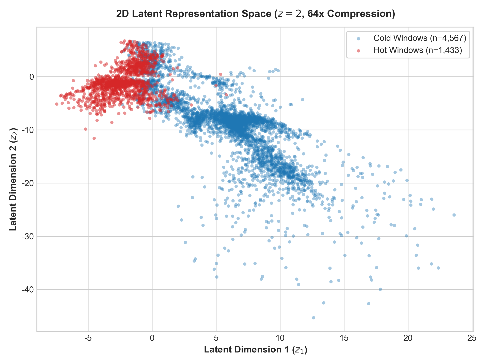
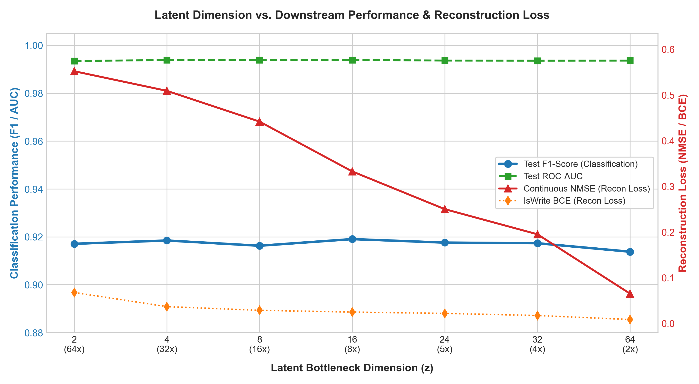

# 實驗結果與泛化能力分析 (Experimental Results & Generalization)

為驗證模型在資源受限環境下的效能，以及跨資料集（Cross-Dataset）的泛化能力，我們採用異質資料集進行訓練，並針對目標資料集進行零樣本（Zero-shot）推論評估。

---

## 1. 隱空間維度掃描實驗 (Latent Dimension Sweep)

以下為不同隱空間維度 $z$（Latent Bottleneck Dimension）對下游冷熱分類與特徵重建表現的影響：

| 隱空間維度 ($z$) | 壓縮倍率 | 測試集 F1-Score | 測試集 ROC-AUC | 連續特徵重建誤差 (NMSE) | 寫入狀態重建誤差 (BCE) |
| :---: | :---: | :---: | :---: | :---: | :---: |
| **2 (本研究選擇)** | **64.0x** | **0.9772** | **0.9993** | **0.5425** | **0.0456** |
| **4** | 32.0x | 0.9718 | 0.9992 | 0.5101 | 0.0312 |
| **8** | 16.0x | 0.9713 | 0.9991 | 0.4493 | 0.0295 |
| **16** | 8.0x | 0.9752 | 0.9993 | 0.3181 | 0.0269 |
| **24** | 5.3x | 0.9743 | 0.9992 | 0.2446 | 0.0239 |
| **32** | 4.0x | 0.9746 | 0.9992 | 0.1802 | 0.0211 |
| **64** | 2.0x | 0.9753 | 0.9991 | 0.0608 | 0.0078 |

> **關鍵發現**：即使在 $z = 2$（**64x** 極限壓縮）下，模型的 F1-Score 依然維持在 $0.9772$ 的最高水準，顯示分類任務不需要高維度資料即可精準判定。

---

## 2. 2D 隱空間聚類分佈 ($z = 2$)

在極限壓縮 $z = 2$ 的條件下，隱空間特徵呈現出極高的可分離性（Separability）：

* **Hot Windows ($n = 1{,}433$)**：高度聚集於左上方區域（ $z_1 \in [-7, 0]$ ），展現強烈且一致的冷熱時空動態。
* **Cold Windows ($n = 4{,}567$)**：主要分佈於右下方區域（ $z_1 > 0$ ），與熱資料形成明確的分離邊界。

---

## 3. 資訊瓶頸與帕累托邊界 (Pareto Frontier)

分析維度掃描趨勢可得以下物理規律：
1. **分類效能飽和（藍/綠線）**：F1-Score 與 ROC-AUC 在 $z \in [2, 64]$ 區間呈現完全平坦且優異的走勢，代表 2 維 Latent 已完全涵蓋冷熱判斷所需的關鍵資訊。
2. **重建誤差收斂（紅/橘線）**：隨著維度增加至 $z = 64$，連續特徵重建誤差 NMSE 從 $0.5425$ 降至 $0.0608$。這證明額外的維度容量僅用於記憶微小的數值細節（如確切的 $\Delta\text{LBA}$ 幅度），對下游語意分類並無實質效益。

---

## 實驗結論 (Key Takeaways)

1. **強健的跨資料集泛化能力（Robust Generalization）**：模型並未過度擬合特定的 LBA 位址，而是能跨資料集擷取出通用的存取行為特徵。
2. **極佳的邊緣部署優勢（Edge Deployment Ready）**：僅需 **2 個latent維度（64x 壓縮）** 即可實現 **F1-Score = 0.9772**，能大幅降低 SSD 控制器（SSD Controller）現場推論時的 SRAM 記憶體開銷與運算延遲。
